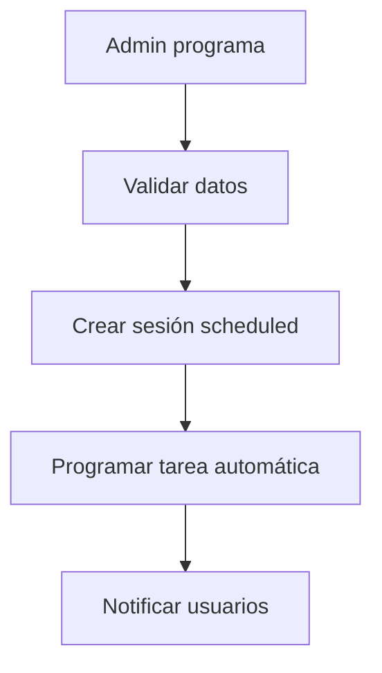
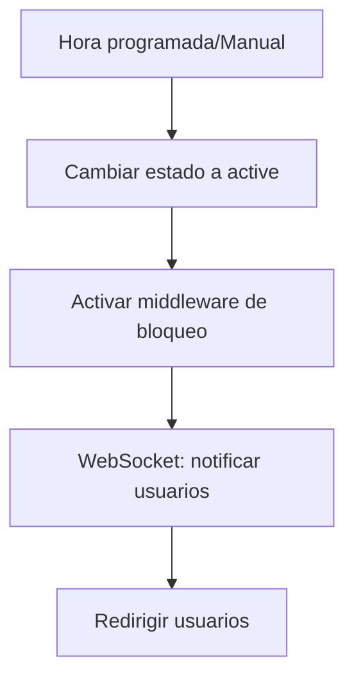
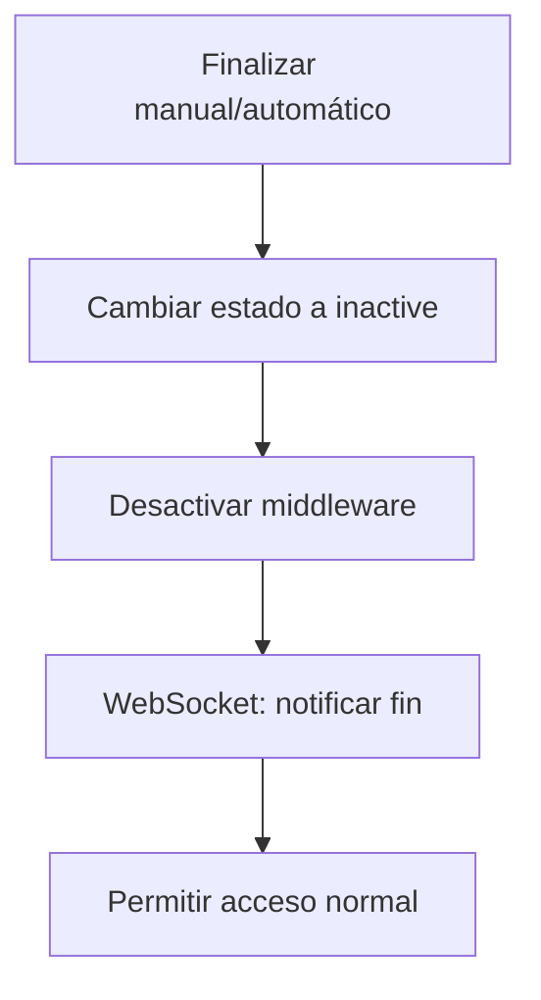

# 🔧 ARQUITECTURA DEL NUEVO MÓDULO DE MANTENIMIENTO
**PresenTickets - Sistema Simplificado y Robusto**

---

## 🎯 PRINCIPIOS DE DISEÑO

### ✅ SIMPLICIDAD RADICAL
- **Una sola tabla principal** (`maintenance_sessions`)
- **Estados mínimos**: `inactive`, `scheduled`, `active`
- **API REST simple** con endpoints específicos
- **UX intuitiva** sin complejidades innecesarias

### ✅ ROBUSTEZ
- **Manejo de errores resiliente**
- **Estados consistentes** con validaciones
- **Recuperación automática** de estados inconsistentes
- **Logs detallados** para debugging

### ✅ MANTENIBILIDAD
- **Código limpio** y bien documentado
- **Separación clara** de responsabilidades
- **Fácil testing** y debugging
- **Configuración centralizada**

---

## 🗄️ DISEÑO DE BASE DE DATOS

### Tabla Principal: `maintenance_sessions`

```sql
CREATE TABLE maintenance_sessions (
  id SERIAL PRIMARY KEY,
  
  -- Información básica
  title VARCHAR(255) NOT NULL,
  description TEXT,
  
  -- Control de tiempo
  scheduled_start TIMESTAMP,
  scheduled_end TIMESTAMP,
  actual_start TIMESTAMP,
  actual_end TIMESTAMP,
  
  -- Estado del mantenimiento
  status VARCHAR(20) DEFAULT 'inactive' CHECK (status IN ('inactive', 'scheduled', 'active')),
  
  -- Configuración
  allowed_roles TEXT[] DEFAULT '{"admin"}',
  maintenance_message TEXT DEFAULT 'Sistema en mantenimiento. Disculpe las molestias.',
  
  -- Auditoría
  created_by INTEGER REFERENCES users(id),
  created_at TIMESTAMP DEFAULT NOW(),
  updated_at TIMESTAMP DEFAULT NOW()
);

-- Índices para performance
CREATE INDEX idx_maintenance_sessions_status ON maintenance_sessions(status);
CREATE INDEX idx_maintenance_sessions_scheduled_start ON maintenance_sessions(scheduled_start);
```

### Estados del Sistema

| Estado | Descripción | Acciones Permitidas |
|--------|-------------|-------------------|
| `inactive` | Sin mantenimiento activo ni programado | Programar nuevo mantenimiento |
| `scheduled` | Mantenimiento programado para el futuro | Iniciar, cancelar, modificar |
| `active` | Mantenimiento activo en curso | Finalizar, extender |

---

## 🔧 ARQUITECTURA BACKEND

### Estructura de Archivos
```
Backend/
├── routes/
│   └── maintenance.js          # API endpoints
├── services/
│   └── maintenanceService.js   # Lógica de negocio
├── middleware/
│   └── maintenanceMiddleware.js # Middleware de bloqueo
└── jobs/
    └── maintenanceScheduler.js # Tareas programadas
```

### API Endpoints

| Método | Endpoint | Descripción | Roles |
|--------|----------|-------------|-------|
| `GET` | `/api/maintenance/status` | Estado actual (público) | Todos |
| `POST` | `/api/maintenance/schedule` | Programar mantenimiento | Admin |
| `POST` | `/api/maintenance/start` | Iniciar mantenimiento | Admin |
| `POST` | `/api/maintenance/end` | Finalizar mantenimiento | Admin |
| `GET` | `/api/maintenance/history` | Historial | Admin |

### Lógica de Negocio (`maintenanceService.js`)

```javascript
class MaintenanceService {
  // Estado actual del sistema
  async getCurrentStatus() { }
  
  // Programar mantenimiento futuro
  async scheduleMaintenance(data) { }
  
  // Iniciar mantenimiento (manual o automático)
  async startMaintenance(sessionId) { }
  
  // Finalizar mantenimiento
  async endMaintenance(sessionId) { }
  
  // Validar consistencia de estados
  async validateSystemConsistency() { }
  
  // WebSocket para notificaciones en tiempo real
  broadcastMaintenanceUpdate(data) { }
}
```

### Middleware de Bloqueo (`maintenanceMiddleware.js`)

```javascript
// Middleware simple que verifica estado activo
export const maintenanceMiddleware = async (req, res, next) => {
  const status = await maintenanceService.getCurrentStatus();
  
  if (status.active && !hasPermission(req.user, status.allowedRoles)) {
    return res.status(503).json({
      error: 'MAINTENANCE_ACTIVE',
      message: status.message,
      endTime: status.endTime
    });
  }
  
  next();
};
```

---

## 🎨 ARQUITECTURA FRONTEND

### Estructura de Archivos
```
Frontend/src/app/
├── maintenance/
│   ├── maintenance.component.ts    # Página de mantenimiento
│   └── maintenance.component.html
├── maintenance-admin/
│   ├── admin.component.ts          # Panel administrativo
│   └── admin.component.html
└── shared/
    ├── services/
    │   └── maintenance.service.ts  # Servicio Angular
    └── guards/
        └── maintenance.guard.ts    # Guard de protección
```

### Servicio Angular (`maintenance.service.ts`)

```typescript
@Injectable({
  providedIn: 'root'
})
export class MaintenanceService {
  private statusSubject = new BehaviorSubject<MaintenanceStatus | null>(null);
  public status$ = this.statusSubject.asObservable();

  // Obtener estado actual
  async getStatus(): Promise<MaintenanceStatus> { }
  
  // Programar mantenimiento
  async schedule(data: ScheduleMaintenanceRequest): Promise<void> { }
  
  // Iniciar mantenimiento
  async start(sessionId: number): Promise<void> { }
  
  // Finalizar mantenimiento
  async end(sessionId: number): Promise<void> { }
  
  // WebSocket para actualizaciones en tiempo real
  private initializeWebSocket() { }
}
```

### Guard de Mantenimiento

```typescript
@Injectable()
export class MaintenanceGuard implements CanActivate {
  async canActivate(): Promise<boolean> {
    const status = await this.maintenanceService.getStatus();
    
    if (status.active && !this.hasPermission()) {
      this.router.navigate(['/maintenance']);
      return false;
    }
    
    return true;
  }
}
```

---

## 🔄 FLUJOS DE TRABAJO

### 1. Programar Mantenimiento


### 2. Iniciar Mantenimiento


### 3. Finalizar Mantenimiento


---

## ⚡ CARACTERÍSTICAS TÉCNICAS

### WebSocket para Tiempo Real
- **Namespace dedicado**: `/maintenance`
- **Eventos**: `maintenance:started`, `maintenance:ended`, `maintenance:scheduled`
- **Reconexión automática** del cliente

### Tareas Programadas (Cron Jobs)
- **Inicio automático**: Basado en `scheduled_start`
- **Fin automático**: Basado en `scheduled_end`
- **Validación de consistencia**: Cada 5 minutos

### Manejo de Errores
- **Estados inconsistentes**: Detección y corrección automática
- **Fallos de red**: Reintentos con exponential backoff
- **Logs estructurados**: Para debugging y auditoría

### Configuración
```javascript
const MAINTENANCE_CONFIG = {
  // Tiempo máximo sin heartbeat antes de considerar desconectado
  MAX_INACTIVE_TIME: 5 * 60 * 1000, // 5 minutos
  
  // Intervalo de validación de consistencia
  CONSISTENCY_CHECK_INTERVAL: 5 * 60 * 1000, // 5 minutos
  
  // Roles por defecto permitidos durante mantenimiento
  DEFAULT_ALLOWED_ROLES: ['admin'],
  
  // Mensaje por defecto
  DEFAULT_MESSAGE: 'Sistema en mantenimiento. Disculpe las molestias.'
};
```

---

## 🧪 TESTING

### Backend Tests
- **Unit tests**: Lógica de servicios
- **Integration tests**: API endpoints
- **E2E tests**: Flujos completos

### Frontend Tests
- **Component tests**: Comportamiento UI
- **Service tests**: Lógica de servicios
- **Guard tests**: Redirecciones

---

## 🚀 VENTAJAS DE ESTA ARQUITECTURA

### ✅ SIMPLICIDAD
- **Una sola tabla** vs 3 tablas anteriores
- **3 estados** vs estados complejos anteriores
- **API clara** con endpoints específicos

### ✅ ROBUSTEZ
- **Estados consistentes** siempre
- **Recuperación automática** de fallos
- **Manejo de errores** completo

### ✅ PERFORMANCE
- **Queries simples** y rápidas
- **Índices optimizados**
- **WebSocket eficiente**

### ✅ MANTENIBILIDAD
- **Código limpio** y documentado
- **Separación de responsabilidades**
- **Testing completo**

---

## 📋 PRÓXIMOS PASOS

1. **✅ Diseño completado**
2. **🗄️ Implementar tabla de base de datos**
3. **🔧 Desarrollar backend service**
4. **🎨 Crear componentes frontend**
5. **🧪 Implementar tests**
6. **🚀 Deploy y validación**

---

**Esta arquitectura garantiza un sistema simple, robusto y mantenible que resuelve todos los problemas identificados en el análisis anterior.**
